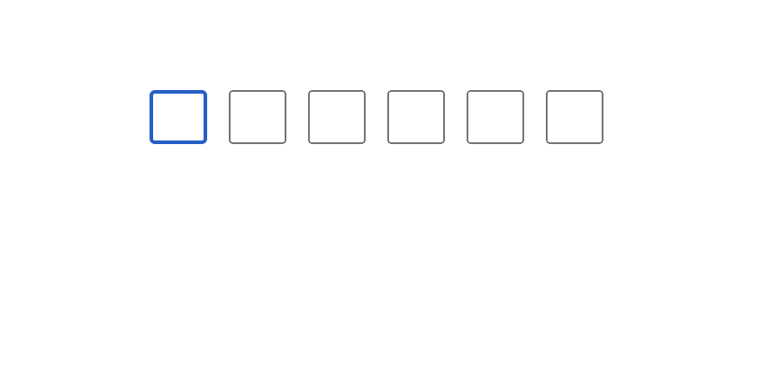

# react-input-otc

One Time Input for verification codes.

## Usage

```js
import React from 'react';
import InputOneTimeCode from './components/InputOneTimeCode';

import './App.css';

function App() {
  return (
    <div className="App">
      <InputOneTimeCode codeLength={6} />
    </div>
  );
}

export default App;
```

## Screenshot

